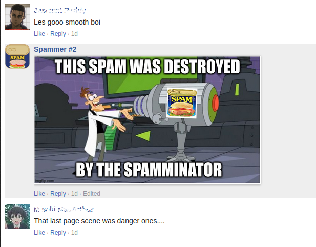

<!-- README template from https://github.com/dthung1602/the-spamminator -->


[![Contributors][contributors-shield]][contributors-url]
[![Forks][forks-shield]][forks-url]
[![Stargazers][stars-shield]][stars-url]
[![Issues][issues-shield]][issues-url]
[![MIT License][license-shield]][license-url]

<!-- PROJECT LOGO -->
<br />
<p align="center">
  <a href="https://github.com/dthung1602/the-spamminator">
    
  </a>

<h3 align="center">The Spamminator</h3>

<p align="center">
    Remove spams from Facebook comment for Mangakakalot & Manganelo
    <br />
    <a href="https://github.com/dthung1602/the-spamminator/issues">Report Bug</a>
    ·
    <a href="https://github.com/dthung1602/the-spamminator/issues">Request Feature</a>
</p>

<!-- ABOUT THE PROJECT -->
## About The Project

Simply get rid of "🔥🔥 neW BaNger aLErt 🔥🔥" in the comment section

#### From this


#### To this


#### Or replace it with a picture



#### Or some text


#### Click on the Spam icon in the tool bar to customize


## Installation

To be updated

## Development

1. Clone the repo
    ```sh
    git clone https://github.com/dthung1602/the-spamminator
    ```
2. Load extension for debugging in Chrome:
    - Make a symlink `manifest.json` -> `manifest-v3.json`
        ```shell
        rm manifest.json
        ln -s manifest-v3.json manifest.json     
        ```
    - Go to [chrome://extensions/](chrome://extensions/)
    - Click on `Load unpacked` button on the top left
    - Select the cloned repo
3. Load extension for debugging in Firefox:
    - Make a symlink `manifest.json` -> `manifest-v2.json`
        ```shell
        rm manifest.json
        ln -s manifest-v2.json manifest.json     
        ```
    - Go to [about:debugging#/runtime/this-firefox](about:debugging#/runtime/this-firefox)
    - Click on `Load Temporary Add-on`
    - Select the manifest.json file
    - Note that Chrome can also load manifest v2, but this will be deprecated in June 2023
4. Package for distribution:
    - Run `build.sh`
    - The output zip files are in the `build` directory
<!-- CONTRIBUTING -->
## Contributing

Contributions are what make the open source community such an amazing place to be learn, inspire, and create. Any contributions you make are **greatly appreciated**.

1. Fork the Project
2. Create your Feature Branch (`git checkout -b feature/AmazingFeature`)
3. Commit your Changes (`git commit -m 'Add some AmazingFeature'`)
4. Push to the Branch (`git push origin feature/AmazingFeature`)
5. Open a Pull Request


<!-- LICENSE -->
## License

Distributed under the MIT License. See `LICENSE` for more information.


<!-- CONTACT -->
## Contact

Duong Thanh Hung - [dthung1602@gmail.com](mailto:dthung1602@gmail.com)

Project Link: [https://github.com/dthung1602/the-spamminator](https://github.com/dthung1602/the-spamminator)


<!-- ACKNOWLEDGEMENTS -->
## Acknowledgements
* [Best README template](https://github.com/othneildrew/Best-README-Template)
* [Img Shields](https://shields.io)
* Random spam meme on the Internet


<!-- MARKDOWN LINKS & IMAGES -->
<!-- https://www.markdownguide.org/basic-syntax/#reference-style-links -->
[contributors-shield]: https://img.shields.io/github/contributors/dthung1602/the-spamminator.svg?style=flat-square
[contributors-url]: https://github.com/dthung1602/the-spamminator/graphs/contributors
[forks-shield]: https://img.shields.io/github/forks/dthung1602/the-spamminator.svg?style=flat-square
[forks-url]: https://github.com/dthung1602/the-spamminator/network/members
[stars-shield]: https://img.shields.io/github/stars/dthung1602/the-spamminator.svg?style=flat-square
[stars-url]: https://github.com/dthung1602/the-spamminator/stargazers
[issues-shield]: https://img.shields.io/github/issues/dthung1602/the-spamminator.svg?style=flat-square
[issues-url]: https://github.com/dthung1602/the-spamminator/issues
[license-shield]: https://img.shields.io/github/license/dthung1602/the-spamminator.svg?style=flat-square
[license-url]: https://github.com/dthung1602/the-spamminator/blob/master/LICENSE
